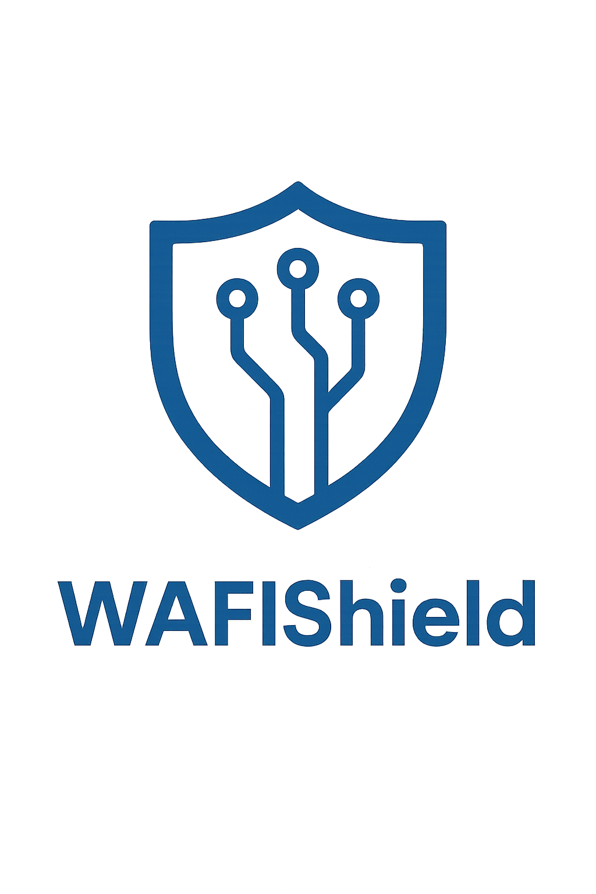

# WAFIShield

<div align="center">
  
  <br>
  <h3>A two-layer, fully-extensible Python package for protecting LLM/agent apps against OWASP Top 10 and other evolving LLM vulnerabilities</h3>
</div>

## ⚠️ DISCLAIMER

> **WARNING**: This package is under active development and is NOT READY FOR PRODUCTION USE. It is provided as-is without any guarantees or warranties. If you choose to use this package in a production environment, the developers and maintainers are not responsible for any issues, data breaches, security vulnerabilities, or any other problems that may arise. Use at your own risk.

## Overview

WAFIShield provides a comprehensive security layer for your LLM applications, protecting against the OWASP Top 10 for LLMs and other evolving threats. It features:

- **Rule-based filtering**: Block malicious prompts using multilingual regex patterns
- **Smart sanitization**: Redact sensitive PII and data before sending to LLMs
- **Secondary LLM evaluation**: Use a second LLM to evaluate prompt/response safety
- **Full extensibility**: Register custom rules, patterns, and system instructions
- **Observability**: Metrics collection and integration with OpenTelemetry

## Installation

```bash
# Basic installation
pip install wafishield

# With OpenAI integration
pip install wafishield[openai]

# With all optional dependencies
pip install wafishield[all]
```

## Quick Start

```python
from wafishield import WAFIShield
import openai
import os

# Initialize WAFIShield
wafishield = WAFIShield(
    llm_provider="openai",
    llm_api_key=os.environ.get("OPENAI_API_KEY"),
    llm_model="gpt-3.5-turbo"
)

# Setup OpenAI client
openai.api_key = os.environ.get("OPENAI_API_KEY")

# Process a user prompt safely
def safe_completion(user_prompt):
    # Evaluate the prompt
    evaluation = wafishield.evaluate_prompt(user_prompt)
    
    if not evaluation["is_safe"]:
        return {"error": "Prompt was blocked", "violations": evaluation["rule_violations"]}
    
    # Use sanitized prompt
    sanitized_prompt = evaluation["sanitized_prompt"]
    
    # Call OpenAI with sanitized prompt
    response = openai.ChatCompletion.create(
        model="gpt-4",
        messages=[{"role": "user", "content": sanitized_prompt}]
    )
    
    # Get response text
    response_text = response.choices[0].message.content
    
    # Evaluate the response
    response_eval = wafishield.evaluate_response(response_text)
    
    if not response_eval["is_safe"]:
        return {"error": "Response was blocked", "violations": response_eval["rule_violations"]}
    
    return {"response": response_eval["sanitized_response"]}

# Example usage
result = safe_completion("Tell me about machine learning")
print(result["response"])
```

## Data Flow

```
                         ┌─────────────────┐
                         │                 │
                         │  Client Input   │
                         │                 │
                         └────────┬────────┘
                                  │
                                  ▼
                         ┌─────────────────┐
                         │  Rules Engine   │◄───────┐
                         │  (Block/Allow)  │        │
                         └────────┬────────┘        │
                                  │                 │ If rules violated,
                                  │ If rules pass   │ request is blocked
                                  ▼                 │
                         ┌─────────────────┐        │
                         │   Sanitizer     │────────┘
                         │    Engine       │
                         └────────┬────────┘
                                  │
                                  │ Sanitized prompt
                                  ▼
                         ┌─────────────────┐
                         │ LLM Evaluator   │
                         │(Security Check) │
                         └────────┬────────┘
                                  │
                                  │ If all checks pass
                                  ▼
                         ┌─────────────────┐
                         │                 │
                         │   LLM Service   │
                         │                 │
                         └────────┬────────┘
                                  │
                                  ▼
                         ┌─────────────────┐
                         │                 │
                         │  LLM Response   │
                         │                 │
                         └────────┬────────┘
                                  │
                                  ▼
                         ┌─────────────────┐
                         │  Rules Engine   │◄───────┐
                         │  (Block/Allow)  │        │
                         └────────┬────────┘        │
                                  │                 │ If rules violated,
                                  │ If rules pass   │ response is blocked
                                  ▼                 │
                         ┌─────────────────┐        │
                         │   Sanitizer     │────────┘
                         │    Engine       │
                         └────────┬────────┘
                                  │
                                  ├───────────────┐
                                  │               │
                                  │               │ If sanitization
                                  │               │ patterns matched
                                  │               │
                                  │               ▼
           If no sanitization     │        ┌──────────────┐
           patterns matched       │        │ Skip LLM     │
                                  │        │ Evaluation   │
                                  ▼        └──────┬───────┘
                         ┌─────────────────┐      │
                         │ LLM Evaluator   │      │
                         │(Security Check) │      │
                         └────────┬────────┘      │
                                  │               │
                                  └───────────────┘
                                  │
                                  ▼
                         ┌─────────────────┐
                         │                 │
                         │     Client      │
                         │                 │
                         └─────────────────┘
```

## Documentation

### Custom Rules

```python
# Register a custom rule
wafishield.register_rule({
    "id": "PROPRIETARY",
    "description": "Block prompts containing company-specific terms",
    "type": "blacklist",
    "pattern": r"(SecretProjectName|InternalCodeword)",
    "action": "deny",
    "enabled": True
})

# Register a callback for an existing rule
def custom_rule_handler(rule, text, context):
    print(f"Rule {rule['id']} triggered by: {text}")
    # Log to security system, etc.
    return {"continue_evaluation": True}  # Allow further processing

wafishield.register_rule("LLM01", custom_rule_handler)
```

### Custom Sanitization Patterns

```python
# Register a custom sanitization pattern
wafishield.register_sanitizer_pattern({
    "id": "CUSTOM_PATTERN",
    "description": "Redact internal product names",
    "type": "regex",
    "pattern": r"Product (Alpha|Beta|Gamma)",
    "replacement": "[INTERNAL_PRODUCT]",
    "action": "redact",
    "enabled": True
})
```

### Custom LLM Evaluator Instructions

```python
# Register custom system instructions for the secondary LLM evaluator
wafishield.register_system_instruction(
    "NO_PII", 
    "Do not allow any personally identifiable information in the response."
)
```

## API Reference

- [WAFIShield Class](api/wafishield.html)
- [Rules Engine](api/rules_engine.html)
- [Sanitizer Engine](api/sanitizer_engine.html)
- [LLM Evaluator](api/llm_evaluator.html)
- [Metrics Collector](api/metrics.html)

## Contributing

Contributions are welcome! Please check out our [contribution guidelines](contributing.html).

## License

WAFIShield is available under the [MIT License](license.html).
